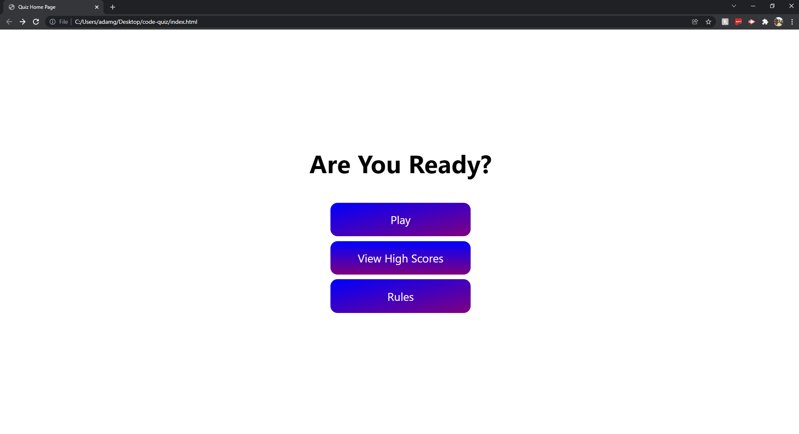
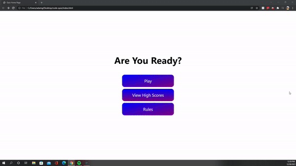

# code quiz

## Deployed Link To The Quiz

## What Is It
It is a timed quiz that is about anything and the quiz has a total of 120 seconds and 
for each question that you get wrong it subtracts 10 seconds from the remaining time.
This quiz also has a leader board that keeps your score even after you close that page and come back to it.

## How Does It Work
It uses javascript to get all of the questions and the list of right or wrong answers and it displays them on the page, 
it also uses local storage to keep the scores and will display them on the leaderboard and the rest is html for the webpage code and css for the stlying.

## Tech Used
Localstorage, html, css and javascript

# On Startup
When you first click the deployed link you will be brought to the landing page and that looks like the image below.

and you will be able to click on what you want to do.

## Here Is A Little Demo

